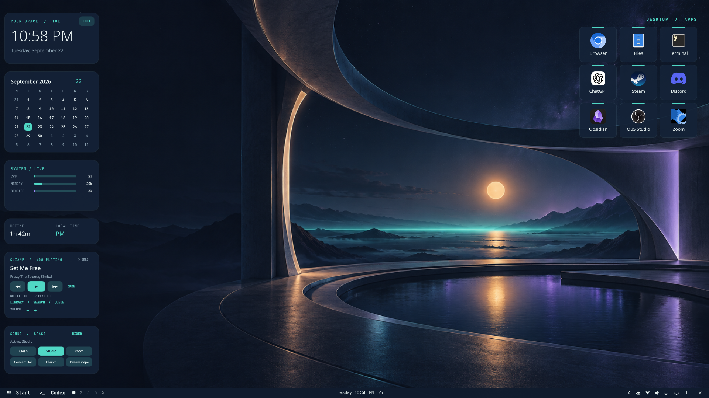

# Night Circuit for Omarchy

A complete desktop theme and music control suite for [Omarchy](https://omarchy.org/).
Night Circuit pairs an original midnight wallpaper with matching window chrome,
menus, notifications, terminal colors, desktop widgets, app shortcuts, and a
cliamp music studio.



## What you get

- A dark navy Omarchy theme with teal, violet, and amber accents, an original
  wallpaper, rounded window borders, and coordinated bar, menu, lock screen,
  browser, terminal, and icon colors.
- Clock, calendar, system gauges, and desktop shortcuts. Widgets follow the
  active Omarchy theme's color and corner shape. Click **EDIT** to customize
  size, side, spacing, opacity, shape, and colors.
- A cliamp widget showing the current track, play/pause, previous/next, volume,
  shuffle, and repeat. **OPEN** focuses an existing cliamp window.
- **LIBRARY / SEARCH / QUEUE** opens a larger music panel with radio and local
  search, playlists, queue browsing, and play or add controls. Cliamp's own
  interface remains available for provider setup and advanced playlist editing.
- Six real Easy Effects presets: Clean, Studio, Room, Concert Hall, Church, and
  Dreamscape. Select them from the desktop widget or music panel; **MIXER** opens
  Easy Effects for detailed adjustments.
- A matching cliamp terminal theme. All music controls use cliamp's local IPC;
  no service credentials are stored in this repository.

## Requirements

- Omarchy with its Lua based Hyprland configuration
- A working graphical session with audio through PipeWire
- An internet connection and administrator access if packages are missing

The installer uses `omarchy pkg add` for Quickshell, cliamp, Easy Effects,
Calf, and LSP plugins. It may ask for your system password in the terminal.

## Install

```bash
git clone https://github.com/ajwilder22/night-circuit-omarchy.git
cd night-circuit-omarchy
./install.sh
```

The installer backs up existing paths it needs to replace under
`~/.local/state/night-circuit-omarchy/backups/`. It preserves an existing widget
settings file, adds one marked line to `~/.config/hypr/autostart.lua`, registers
an Omarchy theme change hook, and enables a user service for Easy Effects.
It applies Night Circuit immediately. On the next login, the widgets and
effects service start automatically.

## Use

- Click **EDIT** in the clock widget to customize the desktop cards. Turn on
  theme color and shape following to keep them matched when switching themes.
- Click **LIBRARY / SEARCH / QUEUE** in the cliamp card to find radio stations,
  browse local music and playlists, or play tracks in the current queue.
- Click a sound space button to change the audio effect. **Clean** removes the
  reverb chain. **MIXER** opens the full Easy Effects interface.
- Set up Spotify, Tidal, Qobuz, or other supported accounts inside cliamp if
  you use them. The desktop panel shows radio and local sources out of the box.

## Uninstall

```bash
./uninstall.sh
```

This restores any backed up files and the previous Omarchy theme. A copy of
your most recent widget settings stays under
`~/.local/state/night-circuit-omarchy/last-widget-settings.json`.

## Design and implementation

The desktop layer is a standalone Quickshell config. Omarchy's packaged files
remain untouched. `theme_sync.py` reads the active Omarchy theme and updates the
widgets through a local JSON palette. `cliamp_state.py` and
`cliamp_library.py` use cliamp's owner-only local control socket. The sound
presets are ordinary Easy Effects JSON files; the running audio service is a
per-user systemd unit.

The wallpaper is original generated artwork prompted as a wide abstract
nightscape with architectural arcs, a teal horizon, and an amber orb. The code
and included artwork are released under the [MIT license](LICENSE).
